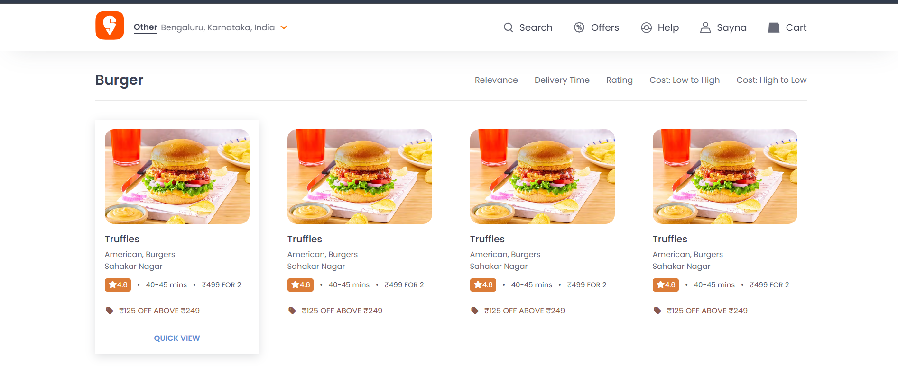

# Swiggy Clone 🍔

A frontend UI clone of Swiggy built using **HTML and CSS**.  
This project focuses on recreating the Swiggy-style restaurant listing interface and improving frontend fundamentals.

---

## 🔹 Features
- Swiggy-style restaurant cards
- Clean and structured layout
- Hover animations on cards and images
- Responsive design (basic)
- Reusable CSS components

---

## 🔹 What I Learned From This Project

###  HTML Concepts
- Writing clean and structured HTML
- Using semantic tags for better readability
- Organizing content into reusable sections
- Linking external CSS properly

---

###  CSS Concepts
- **Flexbox** for horizontal and vertical layouts
- **Box model** (margin, padding, border)
- **Hover animations** using `:hover`
- Smooth transitions using `transition`
- Image handling using `object-fit`
- Border-radius and shadows for card UI
- Managing spacing and alignment like real-world websites

---

###  UI & Design Skills
- Creating card-based layouts (used in real apps)
- Maintaining consistent spacing and sizing
- Understanding how real websites structure components

---

###  Debugging & Practical Learning
- Fixing image alignment and spacing issues
- Understanding relative paths vs local file paths
- Learning why some things work locally but not online
- Getting comfortable with browser inspect tools

---

###  Git & GitHub Basics
- Initializing a Git repository
- Committing changes
- Pushing code to GitHub
- Writing a proper README
- Uploading screenshots to showcase output

---

## 🔹 Tech Stack
- HTML
- CSS
- Git & GitHub

---

## 🔹 Project Output
## Project Output

### Header view

### Footer View
.png)

---

## 🔹 Note
Images used in this project are loaded from Swiggy’s CDN for learning and educational purposes.  
Screenshots are included to showcase the UI output.

---

## 🔹 Future Improvements
- Add JavaScript for search and filter functionality
- Improve mobile responsiveness
- Add dark mode
- Convert to a full-stack application in future

---

## 🔹 Author
**Sayna21**